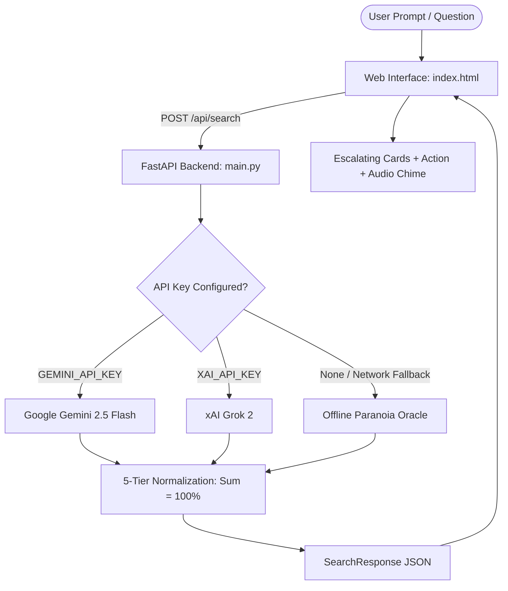

# The Internet's Most Unnecessary Search Engine 🎯

> *"Why find straightforward answers when you can overthink innocent everyday interactions with 99.8% mathematically normalized unearned certainty?"*

---

## Basic Details
### Team Name: The Chronic Overthinkers

### Team Members
- Team Lead: Nidhi M Nair
- Contributor: Team TinkerHub

### Project Description
**The Internet's Most Unnecessary Search Engine** is a tongue-in-cheek AI search platform designed to answer the questions that never needed answering. Instead of returning facts, it subjects innocent, mundane everyday scenarios (like *"Why did my friend text back 'k'?"* or *"My manager used a period instead of an exclamation mark"*) to a rigorous 5-tier probabilistic escalation engine—progressing from ordinary explanations to existential multiverse conspiracies, complete with terrible advice and unearned confidence.

### The Problem (that doesn't exist)
Human beings simply do not overthink their daily social interactions nearly enough. A 2-letter text message or an emoji holds untapped reservoirs of psychological torment and latent cosmic dread that traditional search engines like Google or Bing irresponsibly ignore.

### The Solution (that nobody asked for)
A state-of-the-art search engine that takes your mundane doubt, passes it through a calibrated paranoia pipeline, generates **exactly 5 escalating tiers of absurd possibilities** (whose probabilities strictly sum to 100%), prescribes a **recommended unnecessary action**, and rates its own **unearned confidence**.

---

## Technical Details

### Technologies/Components Used
For Software:
- **Languages**: Python 3.11, JavaScript (ES6+), HTML5, CSS3
- **Backend Framework**: FastAPI, Uvicorn
- **AI / LLM Integration**: Google Gemini 2.5 Flash (`google-genai` SDK & REST), xAI Grok (`httpx`)
- **Offline Reliability Engine**: Built-in Contextual Multiverse Paranoia Engine (guarantees zero-fail demos even without API keys or internet)
- **Audio / UX**: Web Audio API Synthesizer (procedural retro-futuristic sound effects)
- **Styling**: Vanilla CSS3 (Custom design system, glassmorphism, responsive CSS Grid/Flexbox)

---

## Architecture & Workflow



### The 5 Paranoia Tiers
1. **Tier 1: Mundane Reality** (Plausible, ordinary, realistic)
2. **Tier 2: Mild Paranoia** (Slightly suspicious interpretation)
3. **Tier 3: Overanalyzed Vortex** (Reading way too deep into micro-details)
4. **Tier 4: Conspiracy Grade** (Theatrical and borderline unhinged)
5. **Tier 5: Multiverse Catastrophe** (Existential, timeline-swapping quantum chaos)

---

## Implementation & Setup

### Prerequisites
- Python 3.10+
- Modern Web Browser (Chrome, Firefox, Edge, Safari)

### Installation
1. Clone the repository:
   ```bash
   git clone https://github.com/NidhiMNair/useless_project.git
   cd useless_project
   ```

2. Install backend dependencies:
   ```bash
   pip install -r backend/requirements.txt
   ```

3. (Optional) Configure your API Key in `backend/.env`:
   ```bash
   cp backend/.env.example backend/.env
   ```
   Add your `GEMINI_API_KEY` or `XAI_API_KEY`.
   > **Note**: If no API key is provided, the search engine automatically runs in **Offline Paranoia Oracle mode**, ensuring 100% functionality out of the box!

### Running the Application

1. **Start the FastAPI Backend**:
   ```bash
   uvicorn backend.main:app --reload --port 8000
   ```

2. **Open the Web Interface**:
   - Simply navigate to `http://localhost:8000` in your web browser (the backend automatically serves `index.html`).
   - Alternatively, open `index.html` directly in your favorite browser!

---

## Project Documentation

### Screenshots
*(Add your screenshots here)*
- **Search Hero & Paranoia Suggestions**: The initial landing interface with animated radar, prompt chips, and quick randomizer.
- **Overthinking Scan Sequence**: Multi-stage progress indicator scanning through 4.2 million worst-case scenarios.
- **Declassified Dossier**: The 5-tier escalating probability cards, recommended unnecessary action, and confidence gauge.

---

## Team Contributions
- **Nidhi M Nair**: Idea ideation, FastAPI backend design, multi-provider LLM integration, offline fallback engine, and glassmorphic frontend UI/UX engineering.

---

Made with ❤️ at **TinkerHub Useless Projects 3.0**


